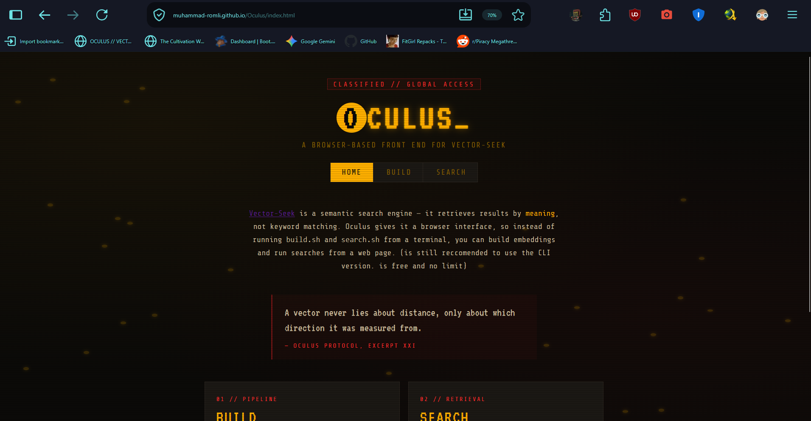
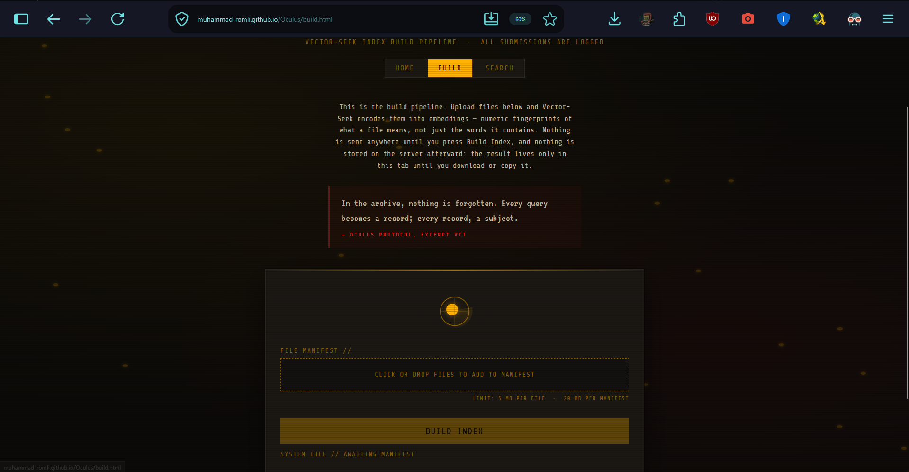
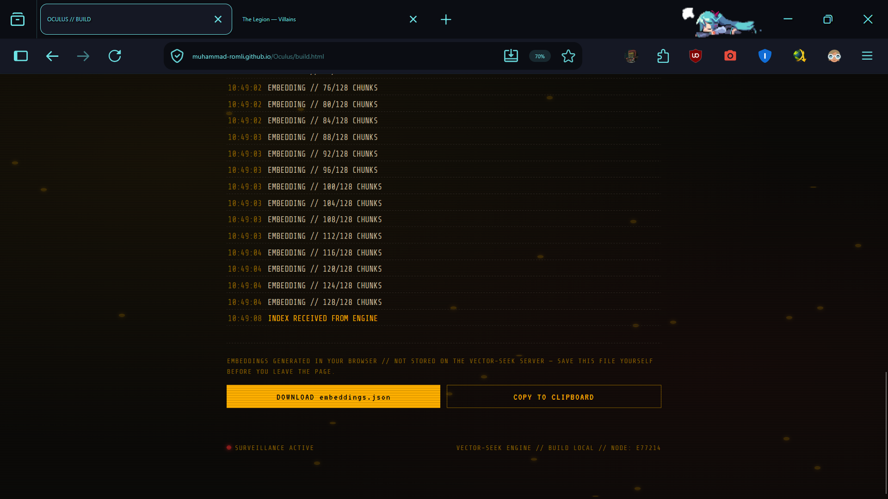
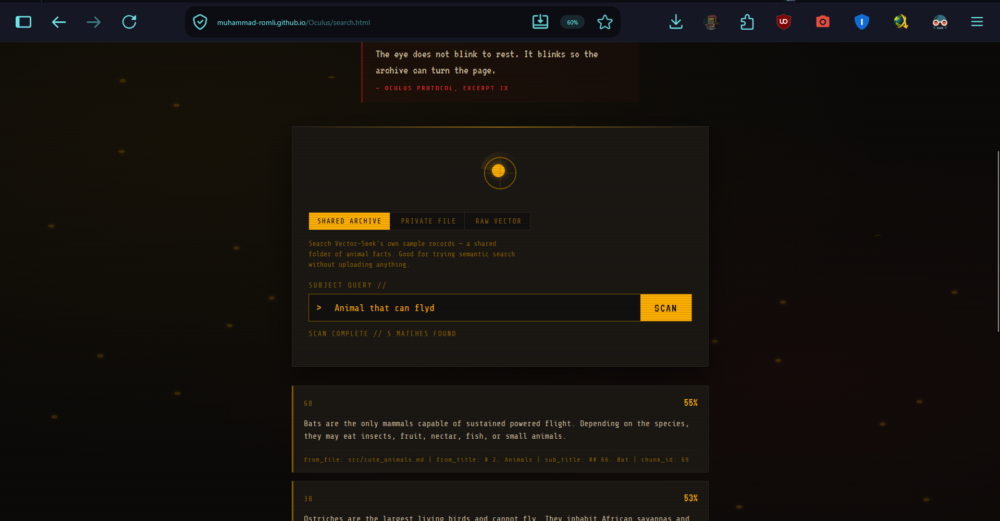

# Oculus


---

## ✨ Project Status: Completed

The web interface for [Vector-Seek](https://github.com/Muhammad-Romli/vector-seek) — a semantic search engine that retrieves results by **meaning**, not keyword matching. Oculus is the frontend;[...]

> **Live site:** [https://muhammad-romli.github.io/Oculus](https://muhammad-romli.github.io/Oculus)

---

## Table of Contents
- [Introduction](#introduction)
- [Pages](#pages)
- [Dependencies](#dependencies)
- [Installation](#installation)
- [Project Structure](#project-structure)
- [Deployment](#deployment)
- [Related Projects](#related-projects)
- [Preview](#preview)

## Introduction

Oculus gives Vector-Seek a browser-based interface, so instead of running `build.sh` and `search.sh` from the terminal, users can build embeddings and run searches through a web page that talks to[...]

## Pages

| Page | Purpose |
|---|---|
| **Home** | Landing page, entry point to the app |
| **Build** | Upload/select files and trigger the build pipeline (generates embeddings) |
| **Search** | Enter a query and view the top matching results |

## Dependencies

Plain HTML/CSS/JS — no framework or build step required.

## Installation

Clone the repo:

```bash
git clone https://github.com/Muhammad-Romli/Oculus.git
cd Oculus
```

Since this is plain HTML/CSS/JS, you can open `index.html` directly in a browser, or serve it locally:

```bash
python -m http.server 8000
```

Then visit `http://localhost:8000`.

> Note: Build and Search pages require the Vector-Seek backend API to be running and reachable — see [Vector-Seek](https://github.com/Muhammad-Romli/vector-seek) for setup.

## Project Structure

```
oculus/
├── index.html        # Home page
├── build.html        # Build page
├── search.html       # Search page
├── css/               # Stylesheets
└── js/                # Frontend logic, API calls to Vector-Seek
```

## Deployment

Oculus is hosted on [Render](https://render.com).

## Related Projects

- **[Vector-Seek](https://github.com/Muhammad-Romli/vector-seek)** — the semantic search backend that powers this interface.

## Preview

#### Video

*(coming soon)*

#### Screenshots

**Homepage**


**Build Page**


**Build Results**


**Search Page**

